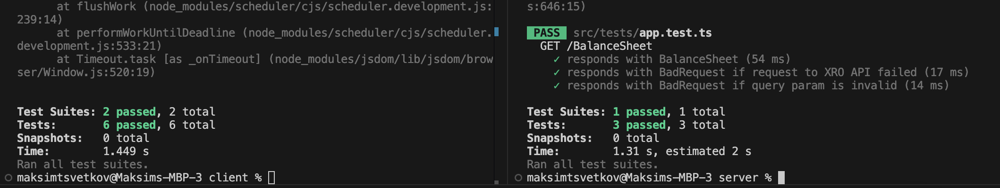

# SHOW ME THE MONEY

I use the original blank list design. It is quite simple but maximum friendly UI to display the XERO Balance Sheet.

## Project structure
This project is structured as a monorepo with separate client and server directories for frontend and backend code, and a lib folder for reusable utilities, and constants.
```
.
├── client/             # Frontend application (e.g., React, Angular, etc.)
│   ├── public/         # Static files like images, icons, etc.
│   ├── src/            # Main frontend code
├── server/             # Backend application (Express)
├── lib/                # Shared logic, constants, and utilities
├── docker-compoese.yml # Compose file to run the project
└── README.md           # Project documentation
```

### Get started

Run the following command in your command-line:

```
   docker-compose up -d --build
```
This will set up:
- the server running on `http://localhost:4000`
- xro docker image running on `http://localhost:3000`
- client app running on `http://localhost:5173`

Open app in your browser `http://localhost:5173` and enjoy the result:


### Run unit tests
```
cd server // from client or server folder
npm run test
```
Result:


### Code formatting with Prettier
```
// from root
npm run test
```

### Error handlers
Processing of various cases is performed on the server and client side
In case of an error, a corresponding message will be displayed on the screen


### Shared lib
Shared lib can be released as a separate packages and reused in multiple places.
I use the following item in `tsconfig.json` to share the lib among server and client apps:
```
{
  "files": [],
  "references": [
    { "path": "../lib" }
  ]
}
```

### TODO (what might be improved)
- it makes sense to go with Lerna or Turbo to set up monorepo design
- use ENV VARIABLES instead of hardcoded values
- improve validation on backend side
- increase test coverage
- improve UI: sheet rendering by improving BalanceSheet, fix edge cases, use more UX practices (apply a11y)
